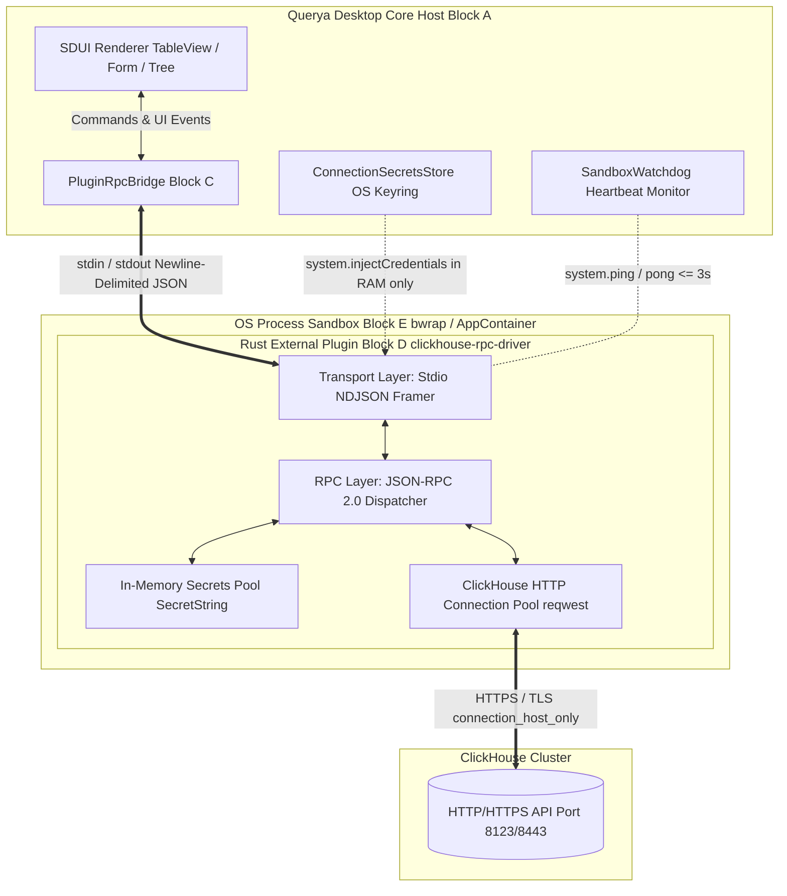

# 🛠️ ТЗ Часть 1: Архитектура Rust-расширения и интеграция с Querya 2.0

> **Проект:** `clickhouse-query-ext` (Querya ClickHouse Database Extension)  
> **Спецификация:** Querya Extension Architecture 2.0 (Блоки A–E Complete)  
> **Язык реализации:** Rust (Edition 2024 / 2021)  
> **Модель выполнения:** Zero-Trust Managed OS Process Sandbox (`bwrap` / `AppContainer`)  

---

## 1. Концепция и обоснование выбора Rust

### 1.1. Проблематика платформы и ограничения песочницы
Querya Desktop написано на Flutter (AOT-компиляция) и реализует строгую архитектуру нулевого доверия (**Zero-Trust Sandbox — Блок E**). Любое стороннее расширение драйвера базы данных (`ExtensionType.databaseDriver`) выполняется как изолированный дочерний процесс операционной системы.  
Для обеспечения стабильности клиентского приложения на процесс накладываются жесткие квоты и ограничения:
* **Лимит оперативной памяти (RAM):** 256 МБ (максимум 512 МБ при пиковых аналитических нагрузках). При превышении Watchdog песочницы убивает процесс по `OOM / SIGKILL`.
* **Лимит файловых дескрипторов:** не более 64 открытых дескрипторов (`ulimit -n`).
* **Ограничение сети:** режим `connection_host_only` (разрешены исходящие TCP/TLS соединения исключительно к хосту и порту активного подключения СУБД).
* **Ограничение ФС:** режим `scratch_only` (чтение `/etc/ssl/certs`, запись только во временную папку `/tmp/querya_sandbox/<id>_<pid>/` до 100 МБ).

### 1.2. Преимущества Rust для драйвера ClickHouse
1. **Предсказуемый след памяти (Zero GC):** в отличие от Node.js, Go или Java, в Rust отсутствует сборщик мусора. Базовое потребление памяти драйвером составляет **~8–12 МБ**, оставляя почти весь объем 256 МБ под буферы данных при чтении миллионных выборок.
2. **Абсолютная безопасность потоков и памяти:** компилятор Rust исключает ошибки гонок данных (`Data Races`), `Null Pointer Dereference` и утечки памяти на этапе сборки.
3. **Высокоскоростная потоковая обработка I/O:** связка асинхронного рантайма `Tokio` и `reqwest` позволяет стримить сырые байты от СУБД ClickHouse прямо в потоки сериализатора `serde_json` без промежуточной буферизации всего ответа в память.
4. **Единый самодостаточный бинарник (AOT Single Binary):** кросс-компиляция под `x86_64-unknown-linux-gnu`, `aarch64-apple-darwin` и `x86_64-pc-windows-msvc` без внешних зависимостей (не требует установленных Node.js, Python или JVM на машине пользователя).

---

## 2. Общая схема взаимодействия (Блоки A, C, D, E)



---

## 3. Внутренняя модульная структура Rust-проекта

Проект организуется по модульному принципу в рамках единого Cargo-воркспейса с четкой изоляцией ответственности:

```
clickhouse-query-ext/
├── Cargo.toml                  # Метаданные проекта и зависимости
├── Cargo.lock
├── README.md
├── manifest.json               # Манифест расширения (.qext) для Маркетплейса Querya
├── assets/
│   ├── icon.svg                # Векторная иконка ClickHouse
│   └── connection_form.json    # Резервная статическая SDUI-схема формы подключения
└── src/
    ├── main.rs                 # Точка входа: старт Tokio runtime, инициализация stdio канала
    ├── config.rs               # Параметры песочницы и конфигурация драйвера
    ├── error.rs                # Доменные ошибки (thiserror) и маппинг в коды JSON-RPC 2.0 (-3260x)
    ├── transport/              # СЛОЙ ТРАНСПОРТА (Блок C Bridge I/O)
    │   ├── mod.rs
    │   ├── stdio.rs            # Асинхронное чтение stdin (LinesStream) и запись stdout (Mutex<Stdout>)
    │   └── framing.rs          # NDJSON (Newline Delimited JSON) фреймер
    ├── rpc/                    # СЛОЙ ПРОТОКОЛА JSON-RPC 2.0
    │   ├── mod.rs
    │   ├── models.rs           # Структуры RpcRequest, RpcResponse, RpcError
    │   ├── router.rs           # Роутер вызовов system.*, db.*, sdui.*
    │   └── handlers/           # Конкретные обработчики
    │       ├── system.rs       # handshake, injectCredentials, ping, shutdown
    │       ├── connection.rs   # connect, disconnect, testConnection
    │       └── query.rs        # query, execute, cancelQuery
    ├── driver/                 # СЛОЙ КЛИЕНТА CLICKHOUSE
    │   ├── mod.rs
    │   ├── client.rs           # Обертка над reqwest::Client с настройками TLS/SSL
    │   ├── pool.rs             # In-Memory Connection & Session Registry
    │   └── options.rs          # Настройки сессии (readonly, max_execution_time, quotas)
    ├── mapper/                 # СЛОЙ КОНВЕРТАЦИИ ДАННЫХ
    │   ├── mod.rs
    │   ├── types.rs            # Парсер типов ClickHouse (Decimal, Array, Map, DateTime64)
    │   └── row_compact.rs      # Конвертер из ClickHouse JSONCompactEachRow в Querya Row Format
    ├── sdui/                   # СЛОЙ GENERATIVE SDUI (Блок A)
    │   ├── mod.rs
    │   ├── form.rs             # Генератор схемы подключения SduiFormSchema
    │   ├── tree.rs             # Построение дерева иерархии SduiTreeSchema / SduiTreeNode
    │   └── actions.rs          # Контекстные меню таблиц и партиций
    └── utils/
        ├── mod.rs
        ├── secret_guard.rs     # Безопасное хранение (SecretString) и зануление буферов (zeroize)
        └── logger.rs           # Санитазированный вывод tracing в io::stderr
```

### 3.2. Основные зависимости (`Cargo.toml`)
```toml
[package]
name = "clickhouse-query-ext"
version = "1.0.0"
edition = "2024"
authors = ["Querya Community"]
description = "High-performance ClickHouse driver for Querya Desktop"

[dependencies]
# Асинхронный рантайм и I/O
tokio = { version = "1", features = ["rt-multi-thread", "io-std", "sync", "macros", "time", "net"] }
tokio-util = { version = "0.7", features = ["codec"] }
futures = "0.3"

# HTTP и SSL для ClickHouse API
reqwest = { version = "0.12", default-features = false, features = ["json", "stream", "rustls-tls"] }

# Сериализация
serde = { version = "1.0", features = ["derive"] }
serde_json = { version = "1.0", features = ["raw_value"] }

# Безопасность памяти и секретов
secrecy = { version = "0.8", features = ["serde"] }
zeroize = { version = "1.8", features = ["zeroize_derive"] }

# Логирование в stderr
tracing = "0.1"
tracing-subscriber = { version = "0.3", features = ["env-filter", "fmt"] }

# Обработка ошибок
thiserror = "2.0"
anyhow = "1.0"
```

---

## 4. Транспортный протокол и требования к Stdio (Блок C)

### 4.1. Построчный обмен JSON (NDJSON)
Обмен данными между Flutter-ядром (Querya Host) и Rust-процессом происходит исключительно через потоки `stdin` и `stdout`.
1. **`stdin` (вход):** каждая входящая команда приходит строго как одна строка (`newline-delimited JSON`). Драйвер читает ее через `tokio::io::BufReader::new(tokio::io::stdin()).lines()`.
2. **`stdout` (выход):** каждый ответ JSON-RPC 2.0 сериализуется в одну строку без переносов (`\n` только в конце) и немедленно сбрасывается (`flush()`).
3. **`stderr` (логи):** любой текст в `stdout`, не являющийся JSON-RPC, ломает парсер ядра. Поэтому **все логи `tracing` направляются исключительно в `std::io::stderr`**.

### 4.2. Санитаризация и защита от утечек секретов
* **`system.injectCredentials`:** пароли подключения поступают в оперативную память через метод JSON-RPC и сохраняются в структуре `secrecy::SecretString`. При завершении сессии или вызове `system.shutdown` вызывается `.zeroize()` для очистки страниц RAM.
* **Фильтрация логов:** `utils::logger` должен перехватывать попытки залогировать сырые строки `connectionString`, HTTP-заголовки `Authorization` или `X-ClickHouse-Key`, заменяя их на `[REDACTED BY RUST DRIVER]`.

---

## 5. Системные методы JSON-RPC 2.0 (`system.*`)

#### 1. `system.handshake` (Жизненный цикл старта)
* **Тайм-аут:** должен ответить менее чем за **3 секунды** после `Process.start`, иначе Watchdog песочницы завершит процесс.
* **Запрос:** `{"jsonrpc":"2.0","id":1,"method":"system.handshake","params":{"queryaVersion":"2.0.0","pluginId":"queryahub.clickhouse-driver"}}`
* **Ответ:**
  ```json
  {
    "jsonrpc": "2.0",
    "id": 1,
    "result": {
      "ok": true,
      "protocolVersion": 1,
      "driverVersion": "1.0.0-rust",
      "capabilities": [
        "db.connect", "db.disconnect", "db.query", "db.execute", "db.cancelQuery",
        "db.getSchemaTree", "db.expandTreeNode", "db.getConnectionFormSchema"
      ]
    }
  }
  ```

#### 2. `system.injectCredentials` (Zero-Trust Injection)
* **Запрос:** `{"jsonrpc":"2.0","id":2,"method":"system.injectCredentials","params":{"connectionId":101,"password":"SecretClickHousePassword!","jwtToken":null}}`
* **Ответ:** `{"jsonrpc":"2.0","id":2,"result":{"ok":true}}`

#### 3. `system.ping` (Heartbeat Watchdog)
* **Тайм-аут:** Watchdog запрашивает пинг каждые 30 секунд. Если ответа нет более **5 секунд**, фиксируется `Deadlock` и отправляется `SIGKILL`.
* **Требование к Rust:** обработчик `system.ping` выполняется независимо от пула тяжелых SQL-запросов и возвращает ответ мгновенно (`< 5ms`).
* **Запрос:** `{"jsonrpc":"2.0","id":100,"method":"system.ping"}`
* **Ответ:** `{"jsonrpc":"2.0","id":100,"result":"pong"}`

#### 4. `system.shutdown` (Graceful Teardown)
* **Запрос:** `{"jsonrpc":"2.0","id":999,"method":"system.shutdown"}`
* **Ответ:** `{"jsonrpc":"2.0","id":999,"result":{"ok":true}}`
* **Действие Rust:** закрыть все HTTP-соединения `reqwest`, очистить (`zeroize`) пул секретов и выполнить `std::process::exit(0)`.

---

## 6. Требования к отказоустойчивости и автовосстановлению

1. **Обработка падений (`Exit Code != 0`):** при сбое сети ClickHouse или ошибке SSL драйвер должен возвращать корректный JSON-RPC Error (`code: -32603`), а не аварийно завершаться по `panic!()`. Любые паники перехватываются через `std::panic::set_hook`, форматируются в `stderr` и завершают процесс с кодом `101`.
2. **Экспоненциальный Backoff:** при аварийном падении подсистема Querya `SandboxAutoRecovery` попытается перезапустить Rust-процесс (не более 3 раз за 5 минут с задержками 1с → 2с → 4с). При старте `main.rs` проверяет целостность scratch-папки и при необходимости пересоздает временные буферы.
