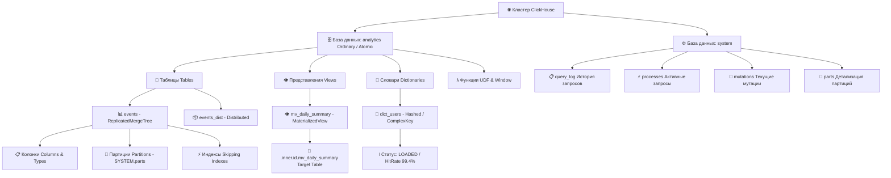

# 📊 ТЗ Часть 2: Рабочие функции ClickHouse для Аналитиков Данных (`Analyst Edition`)

> **Проект:** `clickhouse-query-ext` (Querya ClickHouse Database Extension)  
> **Спецификация:** Querya Extension Architecture 2.0  
> **Фокус документа:** Спецификация функциональности, интроспекции, маппинга типов и аналитических утилит для Data / BI аналитиков  

---

## 1. Потребности Аналитиков Данных в ClickHouse

ClickHouse — это высокопроизводительная колоночная СУБД для задач OLAP (Online Analytical Processing). Аналитики данных ежедневно сталкиваются со спецификой, которую не учитывают классические SQL-клиенты (DBeaver, DataGrip, VS Code):
1. **Сложная архитектура движков (Table Engines):** семейства `MergeTree`, `Distributed`, `Dictionary` и `View` требуют разного подхода к выборкам и оптимизации.
2. **Работа с партициями (`Partitions`):** аналитикам необходимо видеть распределение данных по месяцам/дням в `SYSTEM.parts`, чтобы понимать, какие срезы занимают гигабайты диска или требуют дедупликации.
3. **Специфические типы данных:** `Decimal256`, `DateTime64`, `Array(T)`, `Tuple(...)`, `Map(K, V)` и `Int64/UInt64`. Классические клиенты часто теряют точность при конвертации больших чисел или плохо отображают вложенные структуры.
4. **Безопасность аналитических сессий:** необходимость предотвращения случайных операций `DROP TABLE` на продакшене при написании сложных `JOIN` и агрегаций.

Настоящий Rust-драйвер закрывает все эти потребности через **Generative SDUI** и прямую интеграцию с HTTP API ClickHouse.

---

## 2. Иерархия объектов схемы (SDUI Lazy Tree)

Обозреватель схемы в Querya Desktop строится по принципу ленивой загрузки (Lazy Tree). Драйвер отдает структуру по запросам `db.getSchemaTree` и `db.expandTreeNode`:



### 2.1. Интроспекция через системные таблицы
Rust-драйвер генерирует оптимизированные SQL-запросы к `SYSTEM.*` с форматом вывода `FORMAT JSONCompactEachRowWithNamesAndTypes`:

1. **Список баз данных и движков (`db.getSchemaTree`):**
   ```sql
   SELECT name, engine, comment 
   FROM system.databases 
   ORDER BY name 
   FORMAT JSONCompactEachRowWithNamesAndTypes
   ```
2. **Таблицы, представления и словари с метриками размеров (`db.expandTreeNode`):**
   ```sql
   SELECT 
       t.name AS name,
       t.engine AS engine,
       t.total_rows AS total_rows,
       formatReadableSize(t.total_bytes) AS size_readable,
       t.comment AS comment,
       multiIf(t.engine LIKE '%View%', 'view', t.engine LIKE '%Dictionary%', 'dictionary', 'table') AS object_type
   FROM system.tables t
   WHERE database = {db:String}
   ORDER BY name
   FORMAT JSONCompactEachRowWithNamesAndTypes
   ```
3. **Партиции таблицы (`SYSTEM.parts` — важнейший инструмент аналитика):**
   ```sql
   SELECT 
       partition,
       sum(rows) AS total_rows,
       formatReadableSize(sum(data_compressed_bytes)) AS compressed_size,
       count() AS parts_count,
       min(min_time) AS min_time,
       max(max_time) AS max_time
   FROM system.parts
   WHERE database = {db:String} AND table = {table:String} AND active = 1
   GROUP BY partition ORDER BY partition DESC
   FORMAT JSONCompactEachRowWithNamesAndTypes
   ```
4. **Состояние и здоровье словарей (`SYSTEM.dictionaries`):**
   ```sql
   SELECT name, status, type, element_count, load_factor, formatReadableSize(bytes_allocated) AS size 
   FROM system.dictionaries WHERE database = {db:String}
   FORMAT JSONCompactEachRowWithNamesAndTypes
   ```

---

## 3. Точный маппинг типов ClickHouse -> Querya Standard Schema

Драйвер должен конвертировать типы ClickHouse в типы UI, не допуская потери точности на клиенте (JavaScript `Number.MAX_SAFE_INTEGER` = $2^{53}-1$):

| Тип в ClickHouse (`clickhouseType`) | Маппинг в Querya (`type`) | Правила сериализации (Rust -> JSON) | Обоснование для аналитиков |
| :--- | :--- | :--- | :--- |
| `Int8`, `Int16`, `Int32`, `UInt8/16/32` | `integer` | Число (`1042`) | Стандартный целочисленный диапазон. |
| `Int64`, `UInt64`, `Int128/256` | `string` | **Строка** (`"18446744073709551615"`) | Предотвращение обрезания больших ID пользователей, хэшей и счетчиков в JS/Flutter. |
| `Float32`, `Float64` | `number` | Число (`3.14159`) | Стандартная плавающая точка для метрик. |
| `Decimal(P, S)`, `Decimal256` | `string` | Строка (`"1234567.8901"`) | Гарантия точных расчетов в финансовой и продуктовой аналитике (деньги, конверсии). |
| `String`, `FixedString(N)` | `string` | UTF-8 строка | Полная поддержка Unicode и сырых текстов логов. |
| `Date`, `Date32` | `date` | Строка ISO (`"2026-07-11"`) | Удобная фильтрация по дням. |
| `DateTime`, `DateTime('UTC')` | `timestamp` | ISO 8601 UTC (`"2026-07-11T14:30:00Z"`) | Временные метки событий. |
| `DateTime64(3, 'UTC')` | `timestamp` | ISO 8601 мс (`"2026-07-11T14:30:00.123Z"`) | Миллисекундная и микросекундная точность трекинга. |
| `Nullable(T)` | *зависит от T* | Значение или `null` | Прозрачная распаковка Nullable-обертки. |
| `LowCardinality(String)` | `string` | Распакованная строка | Скрытие внутренней словарной оптимизации от UI. |
| `Array(T)` | `json` | JSON-массив (`["a", "b"]`) | Прямой вывод массивов тегов и событий. |
| `Tuple(a Int32, b String)` | `json` | JSON-объект / массив | Вывод структурированных кортежей. |
| `Map(K, V)` | `json` | JSON-объект (`{"k": "v"}`) | Работа с динамическими атрибутами и JSON-колонками. |
| `IPv4`, `IPv6`, `UUID` | `string` | Строковое представление | Читаемый формат IP-адресов и уникальных идентификаторов. |

---

## 4. Потоковое выполнение запросов и контроль ресурсов

### 4.1. Специфика Streaming-выборки в Rust (`db.query`)
Когда аналитик выполняет запрос `SELECT * FROM analytics.events WHERE event_date = today() LIMIT 100000`, объем сырого JSON может составлять десятки мегабайт.  
Драйвер на Rust:
1. Отправляет запрос через HTTP POST с заголовком `X-ClickHouse-Format: JSONCompactEachRowWithNamesAndTypes`.
2. Читает ответ асинхронным байтовым потоком (`reqwest::Response::bytes_stream()`).
3. Конвертирует строки JSON на лету через `serde_json::from_str::<RowCompact>()` и формирует пачки (`Chunks`) по **5 000 строк**.
4. Если потребление памяти процесса приближается к **200 МБ** (из 256 МБ доступных в песочнице), драйвер корректно останавливает чтение потока и возвращает флаг `isTruncated: true`, предлагая аналитику сузить фильтры в SQL.

### 4.2. Моментальная отмена запросов (`db.cancelQuery`)
Тяжелый OLAP-запрос с агрегацией по десяткам миллиардов строк может блокировать ресурсы кластера.  
* **При старте `db.query`:** Rust-драйвер генерирует уникальный ID и передает его в URL ClickHouse как параметр `query_id=querya-job-<uuid>`.
* **При клике на кнопку Stop (`db.cancelQuery`):** драйвер немедленно отправляет параллельный HTTP-запрос в ClickHouse:
  ```sql
  KILL QUERY WHERE query_id = 'querya-job-<uuid>' SYNC
  ```
  Это освобождает CPU и память на нодах ClickHouse за доли секунды.

---

## 5. Контекстные меню и утилиты для Аналитиков (`sdui.contextActions`)

Через SDUI расширение добавляет в интерфейс Querya специализированные команды для быстрого обслуживания данных без ручного написания DDL:

### 5.1. Действия над таблицей (`table_context_menu`)
* ⚡ **Top 100 Rows:** мгновенная выборка примера данных:
  ```sql
  SELECT * FROM {db}.{table} LIMIT 100
  ```
* 📈 **Column Statistics (Быстрый профайлер):** расчет базовых метрик распределения для выделенной колонки:
  ```sql
  SELECT 
      count() AS total_rows,
      countIf(isNotNull({col})) AS not_nulls,
      uniqExact({col}) AS unique_exact,
      min({col}) AS min_val,
      max({col}) AS max_val,
      topK(5)({col}) AS top_5_values
  FROM {db}.{table}
  ```
* 🔨 **Optimize Table (Final):** принудительное слияние кусков данных (крайне важно для `ReplacingMergeTree` / `CollapsingMergeTree`):
  ```sql
  OPTIMIZE TABLE {db}.{table} FINAL
  ```
* 🧹 **Deduplicate:** удаление дубликатов по ключу сортировки:
  ```sql
  OPTIMIZE TABLE {db}.{table} DEDUPLICATE
  ```
* 📜 **Show DDL (`SHOW CREATE TABLE`):** вывод точного SQL-скрипта создания таблицы с настройками `SETTINGS index_granularity=8192`.

### 5.2. Действия над партицией (`partition_context_menu`)
* 🗑️ **Drop Partition:** удаление устаревшего среза данных:
  ```sql
  ALTER TABLE {db}.{table} DROP PARTITION '{partition}'
  ```
* ❄️ **Freeze Partition (Мгновенный бэкап):** создание жестких ссылок (hardlinks) на куски партиции в `/var/lib/clickhouse/shadow/`:
  ```sql
  ALTER TABLE {db}.{table} FREEZE PARTITION '{partition}'
  ```
* 🔌 **Detach / Attach Partition:** отсоединение партиции от активной таблицы для архивации или переноса на другой диск/S3.

### 5.3. Мониторинг активных процессов и мутаций
* 🔄 **Active Mutations (`SYSTEM.mutations`):** просмотр прогресса выполнения тяжелых `ALTER TABLE ... UPDATE/DELETE`:
  ```sql
  SELECT mutation_id, command, create_time, parts_to_do, is_done 
  FROM system.mutations WHERE table = {table:String} AND is_done = 0
  ```
* ⚡ **Kill Mutation / Query:** возможность отменить зависшую мутацию прямо из интерфейса боковой панели.

---

## 6. Безопасность аналитических сессий ("Safe Mode")

В SDUI-форме подключения (`connection_form.json`) реализуется переключатель **"Аналитический режим (Read-Only / Safe Mode)"**.  
При включении этого режима Rust-драйвер автоматически применяет защитные политики как на клиенте, так и на сервере СУБД:

```json
{
  "key": "safe_mode",
  "label": "Аналитический режим (Safe Mode / Read-Only)",
  "type": "boolean",
  "defaultValue": true,
  "helperText": "Блокирует DROP/ALTER и ограничивает время выполнения и память на сервере ClickHouse"
}
```

### Действие драйвера в Safe Mode:
1. **Настройки сессии ClickHouse (`query_params`):**
   * `readonly = 1` (запрет любых изменений данных и структуры).
   * `max_execution_time = 300` (автоматическая отмена запроса сервером через 5 минут).
   * `max_memory_usage = 10000000000` (лимит 10 ГБ RAM на ноде ClickHouse, чтобы тяжелый `CROSS JOIN` или `GROUP BY` не вызвал OOM кластера).
2. **Проверка AST в Rust (Пре-фильтр):**
   Перед отправкой SQL по HTTP драйвер проверяет первые токены запроса. Если запрос начинается с `DROP DATABASE`, `TRUNCATE TABLE` или `ALTER TABLE ... DROP COLUMN`, драйвер немедленно возвращает ошибку `-32603: Operation blocked by Safe Mode`, даже если у пользователя СУБД есть админские права.

---

## 7. Сводная таблица соответствия ТЗ и возможностей ClickHouse

| Возможность ClickHouse | Реализация в Rust-драйвере (`clickhouse-query-ext`) | Ценность для Аналитика Данных |
| :--- | :--- | :--- |
| **MergeTree Engines** | Полная интроспекция `SYSTEM.tables` и `SYSTEM.parts`. | Видно, сколько места на диске занимает таблица и сколько в ней партиций. |
| **Materialized Views** | Отображение связи `View` ↔ `.inner.id` таблица хранения. | Легко найти физическую таблицу, куда на самом деле складываются агрегаты. |
| **Dictionaries** | Отображение `SYSTEM.dictionaries` (статус, HitRate, память). | Мгновенная проверка, загрузился ли справочник из MySQL / S3 в память ClickHouse. |
| **Big Int & Decimal** | Строковая сериализация в JSON (`"18446744073709551615"`). | 100% точность при расчетах выручки (`Decimal`) и работе с 64-битными ID. |
| **Потоковые выборки** | Стриминг `JSONCompactEachRow` с контролем RAM < 200 МБ. | Возможность выгружать большие выборки без риска падения приложения (OOM). |
| **Отмена (`KILL QUERY`)** | Метод `db.cancelQuery` через `query_id`. | Мгновенная остановка случайно запущенного тяжелого запроса в 1 клик. |
| **Оптимизация (`FINAL`)** | Контекстное меню таблицы (`sdui.contextActions`). | Слияние дубликатов в `ReplacingMergeTree` без ручного ввода SQL-команды. |
| **Safe Mode** | Автоматическая простановка `readonly=1` и лимитов памяти. | Безопасное исследование боевых кластеров без страха сломать продакшен. |
